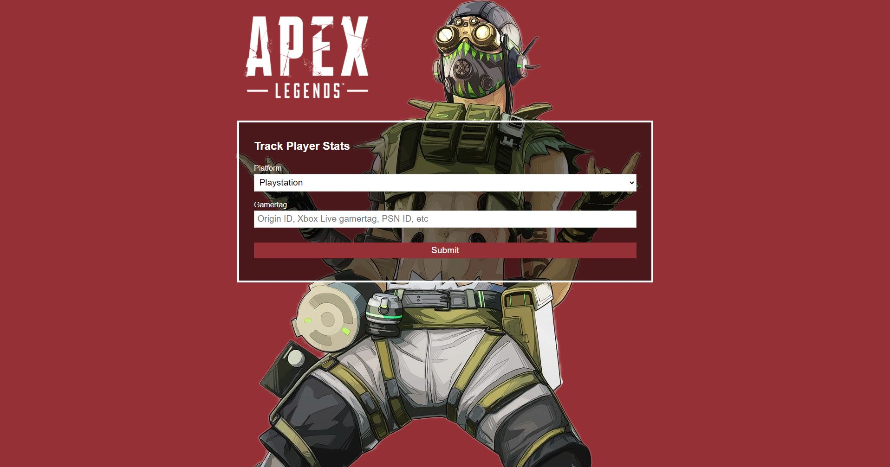

# Apex Legends Tracker

## This is a project for tracking the stats of Apex Legends video game

<a href='https://gamer-apex-legends-tracker-v1.herokuapp.com/' target='_blank'>Apex Legends Tracker</a>

To run this locally, first download this github repository, and rename client folder by removing the underscore at the begining.
Then run "npm i" from both the root folder, as well as seperatley within the "client" folder.
Then from the root folder, run "npm run dev", and view the app from port 8080.

## Technology Stack

Frontend: VueJS
Backend: NodeJS + Express
Other Tools: Axois

